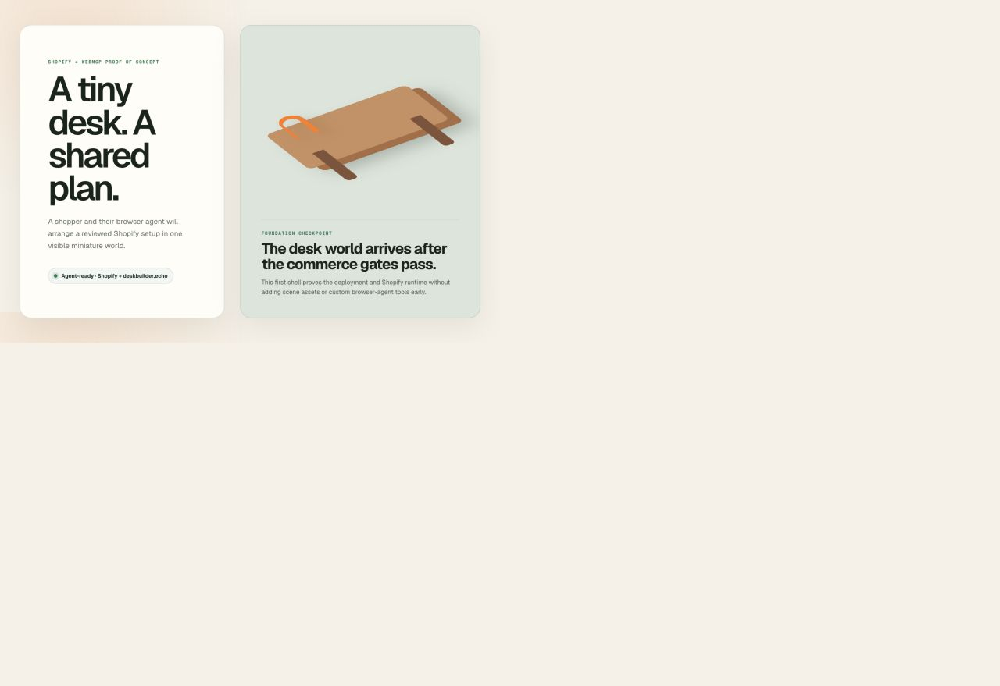
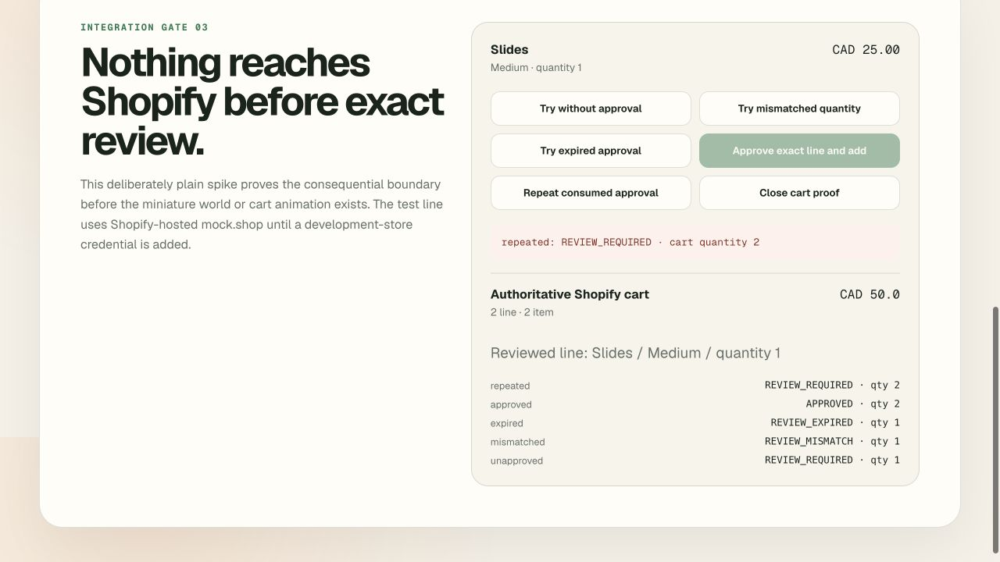
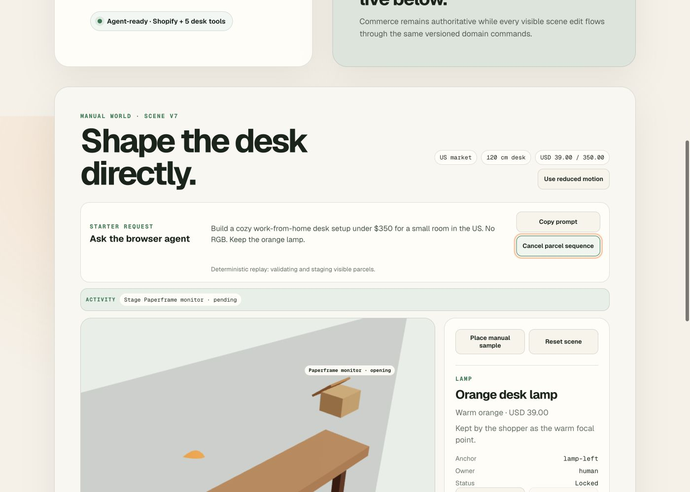
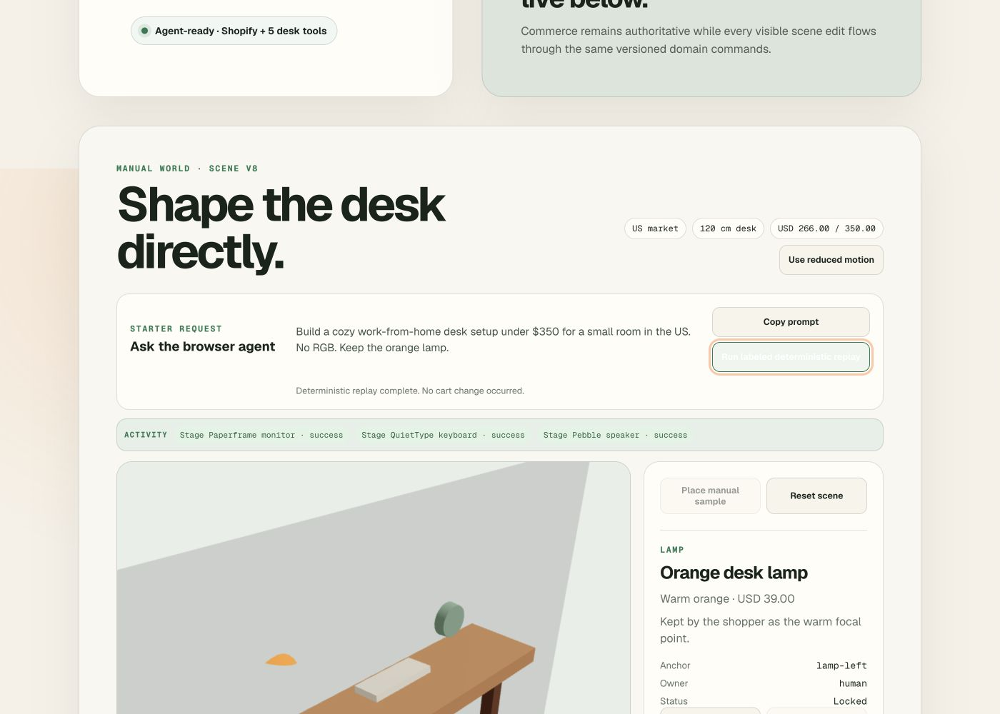
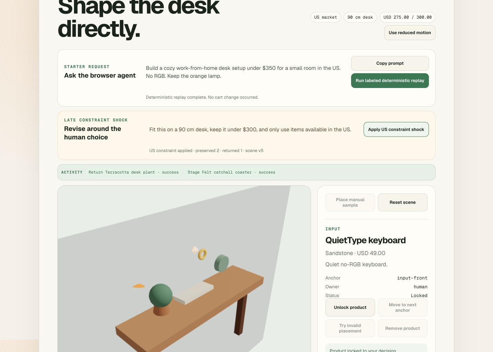
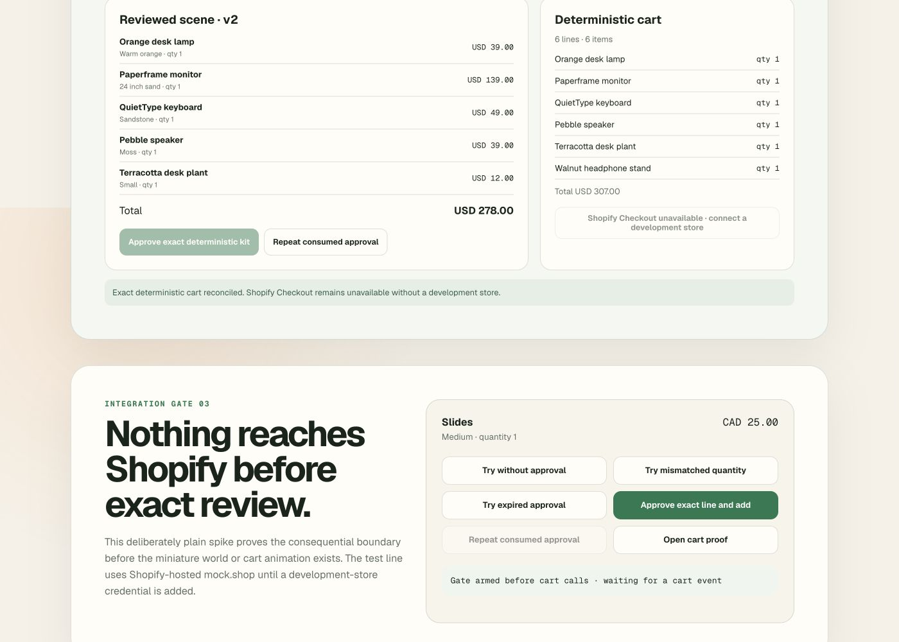

# Integration Evidence

All evidence is sanitized. No Shopify tokens, Vercel credentials, cookies, or
private product data are recorded here.

## Target environment

- Checked: 2026-08-29
- Deployment: <https://devp-one.vercel.app>
- Browser: Codex in-app browser, Chromium/Codex Framework `151.0.7922.174`
- Next.js: `16.3.3`
- React: `19.2.8`
- Shopify Hydrogen: `2026.10.0-preview.1`
- WebMCP types: `0.1.5`
- WebMCP specification snapshot: Community Group Draft dated 2026-08-26

## Item 2 — Shopify and project-tool coexistence

The deployed page reported `Agent-ready · Shopify + deskbuilder.echo`. The
target browser exposed the following exact tool names on the same origin:

```text
deskbuilder.echo
search_catalog
browse_store
get_product
show_variant
get_cart
add_to_cart
update_cart_lines
cancel_cart
proceed_to_checkout
manage_orders
search_shop_policies_and_faqs
```

The inventory contained one project-prefixed tool, eleven Shopify-owned tools,
and no duplicate names.

### Live calls

`deskbuilder.echo` input:

```json
{"message":"Shopify and deskbuilder coexist"}
```

Result:

```json
{"ok":true,"echoed":"Shopify and deskbuilder coexist","tool":"deskbuilder.echo"}
```

Shopify `get_cart` result:

```json
{"item_count":0,"line_items":[],"total_price":null}
```

The browser also invoked `search_catalog` successfully. The default `mock.shop`
shell returned an empty result set, which is expected until a development-store
catalog is connected.

### Lifecycle and fallback checks

- Navigating away from the home experience removed `deskbuilder.echo` from the
  browser's inventory.
- Returning home registered exactly one `deskbuilder.echo`; no leak or duplicate
  registration remained.
- Headless Chromium without WebMCP rendered the non-blocking message
  `Agent tools unavailable · manual shell remains` while keeping the shell usable.
- The target browser omitted the tool callback-options object even though the
  latest draft marks it required. The spike now treats that object as optional
  while still honoring its `AbortSignal` whenever supplied.

### Visual evidence



## Item 3 — human-approved Shopify cart gate

The production shell configured `Shopify.actions.updateCart` once and exercised
the gate against Shopify-hosted `mock.shop` cart state. This is an authoritative
Shopify Storefront API cart session, not the local deterministic commerce
adapter; a participant-owned development store is not connected yet and the UI
states that limitation explicitly.

### Gate cases

| Case | Result | Shopify cart quantity |
| --- | --- | ---: |
| No approval | `REVIEW_REQUIRED` | 1 |
| Approved lines, mismatched quantity | `REVIEW_MISMATCH` | 1 |
| Expired exact approval | `REVIEW_EXPIRED` | 1 |
| Exact one-time approval | `APPROVED` | 2 |
| Reuse consumed approval | `REVIEW_REQUIRED` | 2 |

The session began with one unrelated Slides / Small line from the earlier
handler-behavior spike. The exact reviewed Slides / Medium line was added once;
the gate preserved the pre-existing line instead of erasing it. Shopify
`get_cart` then reported:

```text
Slides / Medium / quantity 1 / CAD 25.00
Slides / Small  / quantity 1 / CAD 25.00
Total: CAD 50.00
```

The Shopify-native `add_to_cart` WebMCP tool was also invoked after the approval
had been consumed. It returned the useful error `Human approval is required for
these exact cart lines`, and a follow-up `get_cart` confirmed quantity and total
were unchanged.

The configured cart event promise settled, the visible proof drawer reconciled
to the action result, and the browser console contained no errors.



## Item 7 — production deskbuilder tool registry

The deployed page exposed exactly these five project-owned tools alongside the
unchanged Shopify native family:

```text
deskbuilder.get_scene
deskbuilder.preview_plan
deskbuilder.stage_plan
deskbuilder.move_product
deskbuilder.get_review
```

Live target-browser execution verified:

- `get_scene`: version `0`, locked orange lamp, six available anchors;
- malformed `preview_plan`: safe `INVALID_INPUT` result;
- valid `preview_plan`: version `1`, three accepted placements, INR `23096.00`;
- stale `stage_plan`: safe retryable `STALE_SCENE` result;
- valid `stage_plan`: version `2`, three confirmed products;
- `move_product`: display moved to `display-wide`, version `3`;
- `get_review`: four exact lines and stable review digest.

No duplicate names or browser console errors were present. The tool inventory
contains no project-owned catalog, cart, or checkout aliases.

## Item 8 — animated starter desk workflow

The target in-app browser executed Shopify `search_catalog("slides")` first and
received one live `mock.shop` product, then ran the project-owned scene chain:

```text
deskbuilder.get_scene
deskbuilder.preview_plan
deskbuilder.stage_plan
```

The page showed one parcel at a time through arriving, opening, revealed, and
placing states. The activity ribbon settled with three successful receipts,
the accessible list matched the four confirmed canvas items, transient packages
were removed, and Shopify `get_cart` was byte-for-byte unchanged before and
after staging.

Cancellation in the target browser cleared the active parcel and preserved the
single locked lamp. The reduced-motion retry completed in 338 ms with the same
four-item result and no browser errors.

Because no participant development-store credentials are connected, Shopify
discovery and the deterministic desk catalog are adjacent proof paths rather
than one shared merchant catalog. The page labels the deterministic replay and
does not claim that its fixture variants came from `mock.shop` search results.





## Market revision after Visual Pause 2

Ashish changed the active MVP market from India to the US. Earlier INR evidence
above is retained as historical verification. The current build now uses:

```text
Market: US
Currency: USD
Starter budget: $350
90 cm constraint-shock budget: $300
Current four-item staged total: $266
```

This revision uses round product-demo budgets and does not claim to be an
exchange-rate conversion.

The final deployed target-browser check returned `market: US`, budget
`USD 350.00`, and a four-item staged total of `USD 266.00` with no console
errors. The Item 8 screenshots were refreshed after deployment and now show
the US prompt and USD amounts.

## Item 9 — US constraint shock and human-edit preservation

The deployed target browser staged the five-item starter desk, locked the
QuietType keyboard, and then applied the canonical revision:

```text
90 cm desk
$300 budget
US availability
```

An agent stage call based on scene version `2` was rejected with `STALE_SCENE`
after the human lock advanced the scene to version `3`. The refreshed revision
then preserved the locked lamp and keyboard plus the unaffected display and
speaker, returned only the wide-desk Terracotta plant, and staged the compact
Felt catchall coaster at `organization-left`. The final total was `USD 275.00`
at scene version `5`.

A second live case moved and locked the display at the 120 cm-only wide anchor.
The 90 cm revision returned `LOCKED_ITEM_CONFLICT`, displayed two relaxation
options, and left the scene byte-for-byte unchanged. No browser errors occurred.



## Item 10 — exact deterministic review and cart fallback

With no participant development store available, the deployed review path is
explicitly deterministic. It reviewed five exact scene lines totaling
`USD 278.00`, preserved one unrelated Walnut headphone stand, and reconciled a
six-line deterministic cart totaling `USD 307.00` after one approval.

Verification covered review invalidation after a simulated price change,
one rejected audio line, accepted-only cart receipts, partial reconciliation,
consumed-approval reuse rejection, and exact retry. Shopify Checkout remained
disabled in both partial and exact fallback states with a credential disclosure.

The separate Shopify-native `add_to_cart` probe remained protected by the Item 3
gate: it returned `Human approval is required for these exact cart lines`, and
live Shopify cart state was unchanged. No participant-store or checkout claim is
made.



## Item 11 — hardened production build

Final automated matrix:

```text
Vitest: 30 tests / 12 files
Integration: 10 tests / 4 files
Playwright: 5 journeys
Agent evals: 10 tests / 6 files
Typecheck, lint, production build: passed
Clean-copy npm ci, typecheck, build: passed
```

The final production smoke checklist is recorded in `docs/production-smoke.md`.
The deployed page returned HTTPS 200 with HSTS and origin-keying, exposed exactly
five project tools, completed a reduced-motion five-item replay, rendered at
390 px without horizontal overflow, and produced no application console errors.

The record-only narrated demo draft is `docs/evidence/demo-draft.mp4`: H.264
video plus AAC audio, 1280×720, 29.96 seconds, 676,061 bytes. It explicitly
states that the cart is deterministic and Shopify Checkout is disabled.

## Item 12 — public handoff verification

- Public repository: <https://github.com/ashish921998/desksembly-webmcp>
- Repository, raw MIT license, and raw narrated MP4 returned signed-out HTTP 200.
- GitHub repository metadata detected `MIT License`.
- A fresh public HTTPS clone passed `npm ci`, typecheck before first build, and
  production build.
- The final Vercel deployment rendered the `Desksembly` heading and metadata,
  exposed exactly five `deskbuilder.*` tools, and logged no browser errors.
- Public YouTube upload remains intentionally deferred to `$prepare-submission`,
  as required by the official Devpost submission format.
